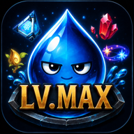

# 💧 고인물 mTTD

> *Torchlight: Infinite* 파밍 수익을 게임 화면 위에서 확인하는 개인용 Android 세션 트래커

  

`고인물 mTTD`는 [listil/mttd](https://github.com/listil/mttd)를 바탕으로 만든 개인 커스텀 포크입니다. 게임을 조작하거나 게임 메모리를 읽지 않습니다. **게임이 스스로 기록하는 로그 파일만 읽어** 획득·소비 아이템과 시세를 바탕으로 수익을 계산합니다.

## ⬇️ 다운로드

  

  
  

1. 위 버튼을 눌러 릴리스 페이지로 이동합니다.
2. **Assets** 아래의 `kd-mttd-….apk` 를 탭해 내려받습니다.
3. 받은 파일을 열어 설치합니다.

> 💡 설치가 막히면 파일을 연 앱(브라우저·파일 관리자)에 대해 **“출처를 알 수 없는 앱 설치 허용”** 을 켜주세요.
>
> 🔄 이미 쓰고 계신다면 앱 안에서 **업데이트 확인** 을 누르는 편이 빠릅니다. 새 버전이 있으면 바뀐 내용이 그 자리에서 펼쳐집니다.

설치한 뒤에는 [처음 사용하는 방법](#-처음-사용하는-방법)을 따라 Shizuku를 준비하면 됩니다. 배포는 최신 버전 하나만 유지하므로, 지난 버전 APK는 따로 받을 수 없습니다.

## ✨ 무엇을 할 수 있나요?

| 기능 | 쉬운 설명 |
|---|---|
| 📊 수익 집계 | 총 수익, 시간당 수익, 이번 맵 수익을 자동으로 계산합니다. |
| 🗺️ 맵별 기록 | 맵을 열 때마다 회차를 나누고, 그래프를 눌러 획득 아이템을 확인할 수 있습니다. |
| 💧 게임 위 미니패널 | 상태·핵심 수치를 게임 위에서 보고, `템` 버튼으로 획득 아이템을 따로 확인합니다. |
| ⏱️ 맵 시간만 측정 | 기본값은 **맵 안에 있을 때만** 시간이 흐릅니다. 마을·메뉴에서는 멈춥니다. |
| ⏯️ 바로 제어 | 미니패널 또는 앱에서 일시정지·재개·초기화를 할 수 있습니다. |
| 💰 시세 선택 | ETor 시즌 시세 또는 TTD 한국 시세를 선택할 수 있습니다. |
| 🔄 앱 내 업데이트 | 새 버전이 있으면 앱에서 APK를 내려받고 Android의 업데이트 화면을 엽니다. |

## 📱 설치 전 확인

| 항목 | 필요 여부 | 내용 |
|---|---|---|
| Android 10 이상 | 필수 | API 29 이상 |
| Torchlight: Infinite | 필수 | 글로벌/탭/중국 패키지를 자동으로 찾습니다. |
| [Shizuku](https://shizuku.rikka.app/) | 필수 | 게임 로그를 읽기 위해 필요합니다. root는 필요 없습니다. |
| 게임 위 표시 권한 | 선택 | 게임 화면 위에 미니패널과 상세 패널을 띄울 때 필요합니다. |

Android 11부터 일반 앱은 다른 앱의 `Android/data` 파일에 바로 접근할 수 없습니다. 고인물 mTTD는 Shizuku를 통해 **읽기 전용**으로 게임 로그를 확인합니다.

## 🚀 처음 사용하는 방법

### 1. APK 설치

위 [다운로드](#-다운로드) 에서 받아 설치합니다.

### 2. Shizuku 준비

앱을 처음 열면 설정 마법사가 순서대로 안내합니다. 화면의 버튼을 따라가면 됩니다.

1. **Shizuku 설치** — Play 스토어 또는 Shizuku의 [APK 다운로드 페이지](https://github.com/RikkaApps/Shizuku/releases)에서 설치합니다.
2. **무선 디버깅 켜기** — 휴대폰의 `개발자 옵션 → 무선 디버깅`을 켭니다.
3. **Shizuku 실행** — Shizuku 앱에서 `무선 디버깅으로 시작`을 누르고 페어링합니다.
4. **권한 요청** — 고인물 mTTD로 돌아와 Shizuku 권한을 허용합니다.
5. **게임 위 표시 권한 허용** — `다른 앱 위에 표시`를 허용하면 게임 위 패널을 사용할 수 있습니다.

> ⚠️ 휴대폰을 재부팅하면 Shizuku가 멈춥니다. 재부팅한 날에는 Shizuku 앱에서 다시 시작해 주세요.

### 3. 게임에서 한 번만 준비하기

집계를 정확히 시작하려면 게임 안에서 아래를 한 번 해주세요.

1. 게임 설정에서 **로그 오픈**을 켭니다.
2. 인벤토리를 열고 **가방 정렬**을 한 번 누릅니다.

준비 상태는 두 단계로 표시됩니다. 먼저 실제 게임 로그를 받으면 `로그 오픈` 단계가 끝나고, 가방 정렬을 감지하면 `가방 정리` 단계도 끝납니다. 이후 아이템 획득과 소비 집계가 시작됩니다. 🎒

## 💧 게임 위 미니패널 사용법

`설정 → 게임 화면 표시 → 게임 위 패널 켜기`를 누르면 게임 화면 위에 미니패널이 뜹니다.

- **미니패널을 탭** → 상세 패널을 엽니다.
- **상세 패널을 탭** → 다시 미니패널로 접습니다.
- **길게 누른 뒤 드래그** → 원하는 위치로 옮깁니다.
- **⏯ 버튼** → 일시정지 또는 재개합니다.
- **🔄 버튼** → 세션을 초기화합니다. 미니패널에서는 두 번, 상세 패널에서는 한 번 누르면 실행됩니다.
- **🚪 버튼** → mTTD를 종료합니다. 이번 세션 기록은 사라집니다. 미니패널에서는 두 번, 상세 패널에서는 한 번 누르면 실행됩니다.
- **템 버튼** → 축약된 획득 아이템 패널을 열거나 닫습니다. 이 패널도 길게 눌러 옮길 수 있습니다.

> 미니패널은 처음에 **총 수익 · 총 시간 · 시간당 수익 세 가지만, 버튼 없이** 표시됩니다. 필요한 항목과 버튼은 `설정 → 미니패널 표시 항목`에서 켜면 됩니다. 버튼을 끈 자리는 수치 칸이 나눠 씁니다 — 상세 패널을 열면 같은 버튼이 모두 있으니 미니패널은 숫자만 보는 용도로 둬도 됩니다.

### 신호 색상

| 색상 | 표시 | 뜻 |
|---|---|---|
| 🟢 초록 | 진행중 | 정상적으로 집계하고 있습니다. |
| ⚪ 회색 | 대기중 | 맵 안에서만 시간 측정 설정이며, 현재 맵 밖에 있습니다. |
| 🟠 주황 | 로그 오픈 | 게임 로그 수신을 기다리고 있습니다. |
| 🟠 주황 | 가방 정리 | 로그는 연결됐고, 가방 정렬을 기다리고 있습니다. |
| 🔴 빨강 | 중지중 | 사용자가 일시정지했습니다. |

### 미니패널 항목

| 항목 | 뜻 |
|---|---|
| 맵핑 횟수 | 이번 세션에서 맵에 들어간 횟수 |
| 현재 맵 | 현재 맵에서 실제로 보낸 시간 |
| 총 수익 | 이번 세션의 누적 수익 |
| 총 시간 | 설정한 기준에 따라 누적된 시간 |
| 시간당 | 총 수익을 총 시간으로 나눈 값 |
| 이번 맵 | 현재 맵에서 얻은 수익 |

> 기본 시간 기준은 **맵 안에서만 측정**입니다. 앱의 `설정 → 게임 화면 표시 → 시간 측정 방식`에서 항상 측정으로 바꿀 수 있습니다.

## 🧭 앱 화면 안내

| 탭 | 할 수 있는 일 |
|---|---|
| **수익** | 총 수익·시간당 수익·경과 시간 확인, 일시정지/리셋, 맵별 그래프와 아이템 목록 확인 |
| **자산** | 현재 가방에 있는 아이템의 예상 가치를 확인 |
| **설정** | Shizuku 상태, 게임 화면 표시, 시간 측정 방식, 시세 출처, 로그 연결 상태 |

## 🔄 업데이트 방법

앱을 열면 새 버전을 자동으로 확인합니다. 새 버전 안내가 보이면 **앱에서 업데이트**를 누르세요.

1. 앱이 새 APK를 다운로드합니다.
2. Android 시스템 설치 화면이 열립니다.
3. `업데이트`를 눌러 현재 앱 위에 설치합니다.

자동 설치는 Android 보안 정책상 지원하지 않습니다. 마지막 설치 승인만 사용자가 해주면 됩니다.

## 🔒 개인정보와 권한

| 항목 | 처리 방식 |
|---|---|
| 게임 로그 | Shizuku로 읽기만 합니다. 파일을 만들거나 고치거나 삭제하지 않습니다. |
| 수익 기록 | 기기 안에만 저장됩니다. |
| 네트워크 | 시세, 앱 업데이트 확인, 아이템 아이콘을 위해서만 사용합니다. |
| 민감한 권한 | 위치·카메라·마이크·전화 상태·광고 ID 권한을 요청하지 않습니다. |

사용되는 외부 서비스는 다음과 같습니다.

- `etor-zero.981001.xyz` — ETor 시즌 시세
- `ttdiablo.com` — TTD 한국 시세
- `api.github.com` — 새 버전 확인 및 APK 다운로드
- `cdn.tlidb.com` — 아이템 아이콘 표시

## ⚖️ 라이선스 및 안내

[MIT](LICENSE)

아이템 아이콘과 이름 데이터는 *Torchlight: Infinite*의 자산이며 저작권은 XD/FastFish에 있습니다. 이 프로젝트는 비공식 팬 도구이며 게임 개발사와 관계가 없습니다.
